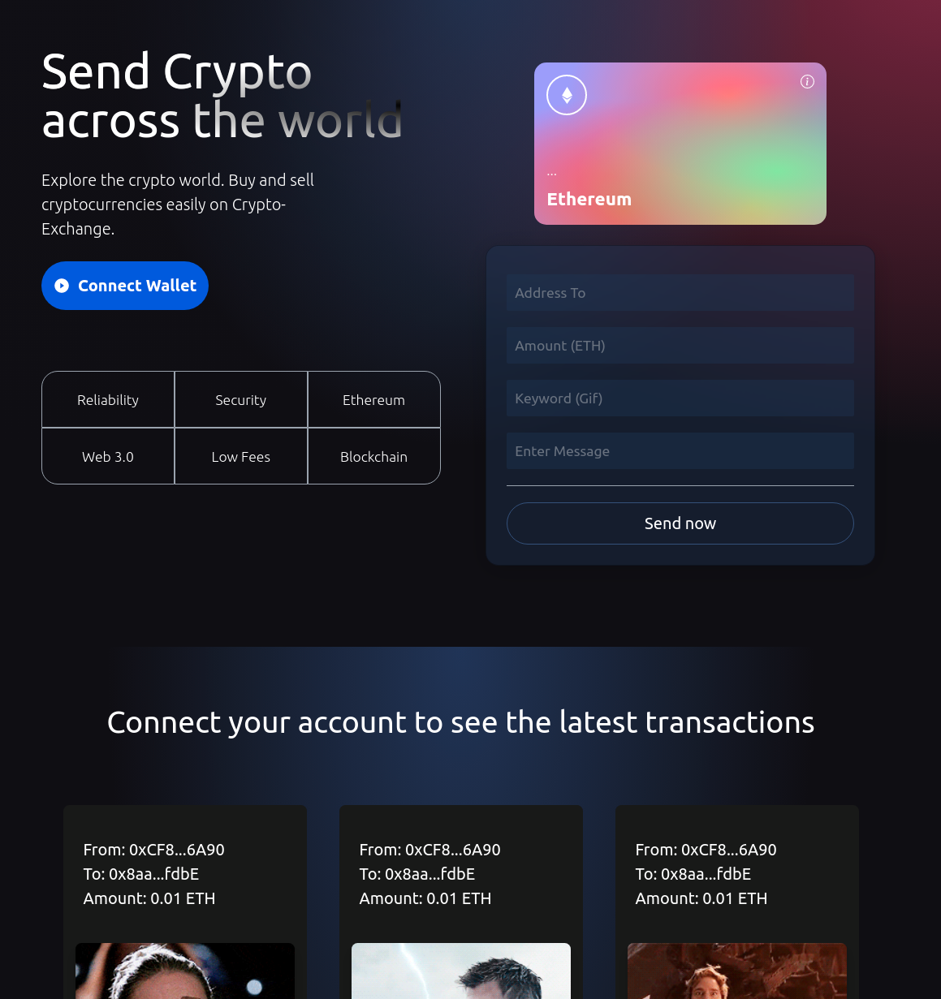

# Crypto Exchange

## Deployed Site: https://crypto-exchange-ab.netlify.app/

## Technology Used

- React
- Hardhat
- Metamask
- Solidity
- Tailwind
- Vite

## Installation

- Fork/Clone or download Zip
- Add Vite giphy secret key to environment variables
- Run npm install in smart_contracts directory as well as client directory
- Add Url and account to hardhat config file
- Run hardhat compile and hardhat run to migrate contract
- run npm start in client directory

## User Stories

- As a user I would like to be able to connect to my digital wallet
- As a user I would like to be able to send money to any account
- As a user I would like to see a record of the transaction
